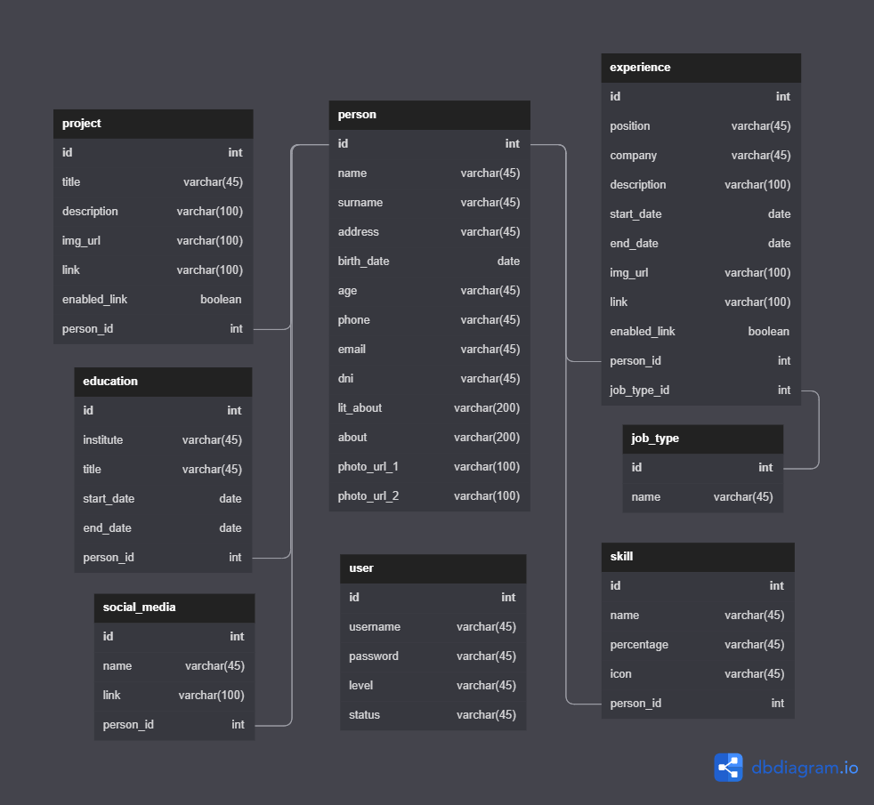

# **Bitácora**
**Título del proyecto:** Uriel Spiridione – Arg. Programa Portfolio.   
**Autor:** Uriel Spiridione.  
**Github**: **https://github.com/USpiri/Portfolio_ArgPrograma**  

* * * 
## **Aclaraciones**
Antes de comenzar con el desarrollo de la bitácora considero importante explicar algunos puntos a tener en cuenta, como la temática del proyecto, el bosquejo inicial, etc.  
El objetivo es desarrollar una aplicación web full stack durante el cursado de Argentina Programa, tal y como se plantea en la siguiente **“[Guía sobre el trabajo final integrador TP](https://argentinaprograma.inti.gob.ar/mod/resource/view.php?id=1033)”**. En el primer módulo se mencionan sugerencias como el uso de Figma para crear el prototipo (Lo entendí como bosquejo) y si bien nos dan un diseño a seguir, este es puede ser modificado siempre que mantenga la estructura básica del proyecto, por lo que he optado por hacerlo a mano. El esquema es el siguiente:  
  
  
  
Actualmente (28/05/22) me encuentro terminando el módulo 8 del curso. Ya avancé con el portfolio y realicé los ejercicios mencionados en cada módulo (En su mayoría) pero muchas cosas de este “Primer proyecto” fueron a modo de prueba, sin conocer o sin aplicar realmente muchas de las tecnologías aprendidas durante el cursado, por lo que me he propuesto a realizar nuevamente el trabajo final, aplicando estas mejoras. Supongo que a lo largo de la bitácora se volverán a repasar temas de módulos anteriores y/o hacer comentarios del “primer proyecto”.  
Hoy hablando con la profesora de nuestro grupo le comenté mi avance y me fue dando una serie de detalles a implementar que anoté en una **“Lista de tareas”** que se irá modificando a medida que pase el tiempo, por ahora es esta:
+ ~~**Diagrama de BBDD y BBDD**~~ (Mención de la profesora)
+ ~~**Implementar Bootstrap**~~ (Mención de la profesora)
+ ~~**Idea de Bitácora**~~ (En proceso) (Mención de la profesora)
+ ~~**Realizar proyecto Angular**~~
+ ~~**Realizar control de versiones con Git**~~
+ **Ver segunda masterclass Modulo 8**  

Por hoy, el avance es solo el comienzo de la bitácora. La idea es no solo poder tener registro de cada avance, sino también de anotar ideas, mejoras o problemas que me vaya encontrando durante el proceso, junto con sus soluciones.  

## **Registro:** 
*Formato: + **[ día/mes/año ]:** [ Descripción ]*  

+ **[ 1/6/22 ]:** Creación del proyecto en Angular, primer commit y creación de los componentes principales (Header, about, education, experience, skill, projects, contact y footer). Eliminé el repositorio del proyecto anterior y cree uno nuevo al cual subí los avances realizados el día de hoy, teniendo en cuenta la estructura del proyecto recomendada en la guía (Carpetas separadas para el front end, back end y base de datos) adicionalmente hay una carpeta para la bitácora y sus respectivos recursos u otros archivos de necesidad. También comencé a investigar cómo funciona Bootstrap y como implementarlo en el proyecto.  

+ **[ 9/6/22 ]:** Luego de un tiempito pude volver a avanzar en el proyecto, sufrí un robo y se llevaron mi notebook por lo que ahora estoy desde una computadora prestada y los únicos archivos que recuperé son los que estaban en github (Punto para github). El día de hoy el avance fue instalar los programas (Git, VScode, Node, Angular, Bootstrap, etc.) y el navbar en el componente header.  
La mayoría de las clases en Bootstrap utilizan un guion medio, por lo que para distinguir mis clases voy a utilizar guion bajo.  
Me encontré con un problema a la hora de instalar Bootstrap ya que la versión instalada de Angular es la 14 (Lanzada el 2 de junio de este año) y Bootstrap actualmente no se encuentra disponible para esta versión de angular. Al proyecto lo actualicé a la nueva versión de Angular pero me va a tocar hacer un downgrade a la versión 13 de Angular para poder hacer uso de Bootstrap. También descubrí el uso de markdown (Archivos .md) por lo que posiblemente lo implemente para la escritura de la Bitácora, de momento está escrita en Word y seguramente en el historial de commits de Github haya varios intentos de hacerla en HTML u otras formas.

+ **[ 13/6/22 ]:** Terminé el componente header, junto con sus botones de edición y arreglé detallitos en el navbar.  
Al archivo genérico styles.css le agregue dos clases, una para los botones de edición y otro para los botones comunes que use durante el desarrollo de la página (no son muchos, pero me voy a evitar hacerlos cada vez, y van a mantener todos la misma estética haciéndolos en este archivo). El margin y el padding de ser necesarios los puedo cambar con las clases de Bootstrap.  
**“Lista de tareas”**  
    + ~~**Componente Header**~~
    + ~~**Agregar cursor pointer el botón de editar**~~
    + ~~**Componentes About, Experiences, Educations, Skills, Projects, Contact y Footer**~~  

+ **[ 14/6/22 ]:** Algo en lo que no pensé es en la parte de edición, para cambiar la información del portfolio. En principio tenía la idea de desplazar algunos elementos, e incluso hacer que “desaparezcan” con alguna clase de efecto smooth, y aparezca un input que me permitiera cambiar el contenido de la base de datos. Pero husmeando en la página de Bootstrap encontré los **“Modal”** que literalmente pueden ser justo lo que necesito para esta función, me permiten “abrir una ventana” encima del body y poder poner, por ejemplo, un formulario dentro con sus respectivos botones para cerrar y/o guardar cambios. **Quedará pendiente indagar sobre el tema.**  
Agregué el cursor pointer al elemento que lo necesitaba, moví el componente navbar fuera del header para poder hacerlo sticky (ahora este es un componente extra a los componentes básicos) y que se mueva libremente por encima de todos los componentes y avancé con About, Experience, Education y Skills.  
También estuve pensando como proseguir con la página, la pensé para que sea cada sección como una presentación de P.P y utilizando el "*snap scrolling*" de CSS, pero haciendo pruebas me di cuenta que es medio incomodo e incluso lento a la hora de navegar dentro del sitio. Por lo que posiblemente al final no haga uso de este método.  
+ **[ 15/6/22 ]:** Implementé la librería *SwiperJS* que me permite hacer un carrusel para las tarjetas de cada proyecto (Cambiando un poco el diseño original, me quedará pendiente el dibujo), si bien Bootstrap también tiene su propia funcionalidad me decanté por el uso de la librería. La cantidad de tarjetas en pantalla depende del ancho de esta mediante el uso de breakpoints similares a los de Bootstrap y estas pueden ser tantas como quiera teóricamente, pero supongo que se mantendrán entre 6 y 9. Con esto terminé el componente Proyects.  
Los últimos dos componentes (Contact y Footer) no tuvieron muchas complicaciones. Otro cambio de diseño, aparte del carrusel de proyectos, es al título de contacto lo puse vertical a la derecha y al botón lo coloqué debajo de los inputs. El footer no tiene grandes diferencias con respecto al esquema.  
Tengo varias ideas posibles de implementar y algunas correcciones que hacer:  
    + **Bootstrap Modal para editar info en BBDD e inicio de sesión** (A implementar)
    + **Bootstrap Toast al cambiar datos (Mostrar error o éxito)** (A testear)
    + **Bootstrap Scrollspy para el navbar** (A testear)
    + ~~**Hacer horizontalmente mas chicas las tarjetas Skills** (A testear)~~
    + ~~**Agregar botones Edit y Delete en las tarjetas Experience, Education y Projects** (A implementar)~~
    + ~~**Agregar botón Edit en las tarjetas Skills** (A implementar)~~
    + ~~**Hacer vertical el componente Header, About y Contact para dispositivos** (A implementar)~~
    + ~~**Hacer verticales Header y About para dispositivos y eliminar una de las dos imágenes** (A testear)~~
    + ~~**Hacer vertical Contact y cambiar el orden de las tarjetas (Ver de implementar Bootstrap rows y cols para esto)** (A testear)~~
    + ~~**Hacer Skills más responsive** (A implementar)~~
    + ~~**Cambiar estilo de las barras de progreso en Skills**(A testear)~~  
+ **[ 16/6/22 ]:** Comencé con las tareas referidas a Skills, las barras de progreso son un poco más chicas, les saqué el degradé, tienen sus botones de edición y se acomodan al tamaño de la pantalla. Y agregue los botones de edición en los componentes que lo necesitaban y elimine botones en donde sobraban. La mayoría de los botones tiene posición absoluta para que no interfieran con otros elementos.  
+ **[ 17/6/22 ]:** Estuve probando el Scrollspy de Boostrap y no logre hacer que funcione, pero por lo poco que investigue tengo un par de opciones para probar, la primera es hacer alguna clase de servicio que agregue una clase a los ítems del navbar para que queden seleccionados mientras se navega dentro del sitio o ubicar en navbar en app.component y a cada uno de los otros componentes introducirlos en un div con su respectivo id. Modal y Toast los voy a dejar para cuando tenga hecho algo de la BBDD.  
Avancé con Contact, hice el título se vea en la parte superior cuando la ventana es chica (Como antes de ponerlo al costado), el contenido se vertical y dos de las tres tarjetas desaparecen. Estas últimas ya no tienen un ancho fijo, los inputs tampoco. Al final no utilice rows y cols para hacerlo, simplemente diciéndole a cada componente que cambie el display de acuerdo a un determinado breakpoint. En About la imagen desaparece y se acomoda al tamaño de la pantalla, Header también solo que los elementos paran a estar verticales, ninguno se va. También hice una pequeña corrección de errores, el componente header no tenía id (por lo que no se ubicaba al presionarlo desde el navbar). Creo que ya estaría listo para empezar con la base de datos.  
+ **[ 20/6/22 ]:** Esta mañana (Viendo TioTok) me encontré con esta página ***[SQL Murder Mystery](https://mystery.knightlab.com/)*** me pareció espectacular para practicar consultas SQL y muy entretenida. La compartí por el foro del curso, espero le pueda servir a alguien más. Comencé con la instalación de los programas necesarios para gestionar la base de datos y, para mas adelante, programar en Java. También hice un repaso del capitulo 4 de BBDD y estoy utilizando la página ***[dbdiagram.io](https://dbdiagram.io/)*** para hacer el diagrama.  
De momento este es el diagrama inicial para la base de datos, hay algunos detalles a comentar que pueden llegar a sufrir cambios como las variables start_date y end_date (podrían pasar de date a varchar), lit_about (a un varchar más chico), experience.description (a un varchar más grande) y algún que otro cambio de la misma naturaleza que los dos anteriores.  
  
No creo que sea necesario hacer tablas extra para mail, teléfono o algún otro campo. Pero de ser necesario los agregaré en el futuro. La BBDD ya se encuentra hecha en MySQL.

