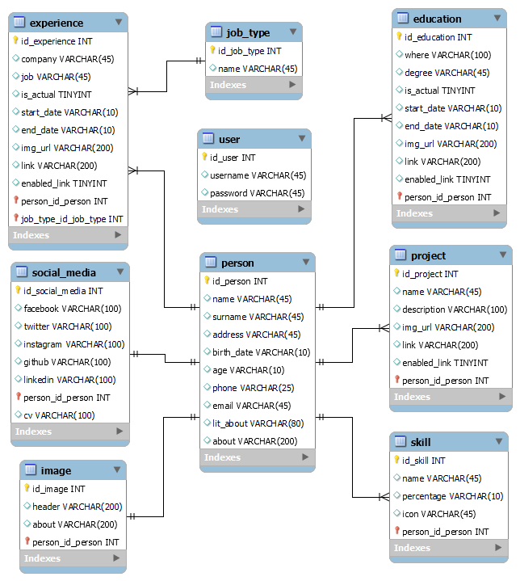

# **Bitácora**
**Título del proyecto:** Uriel Spiridione – Arg. Programa Portfolio.   
**Autor:** Uriel Spiridione.  
**Github**: **https://github.com/USpiri/Portfolio_ArgPrograma**  
**Github Pages**: **https://uspiri.github.io/** (static page only for preview)

* * * 
## **Aclaraciones**
Antes de comenzar con el desarrollo de la bitácora considero importante explicar algunos puntos a tener en cuenta, como la temática del proyecto, el bosquejo inicial, etc.  
El objetivo es desarrollar una aplicación web full stack durante el cursado de Argentina Programa, tal y como se plantea en la siguiente **“[Guía sobre el trabajo final integrador TP](https://argentinaprograma.inti.gob.ar/mod/resource/view.php?id=1033)”**. En el primer módulo se mencionan sugerencias como el uso de Figma para crear el prototipo (Lo entendí como bosquejo) y si bien nos dan un diseño a seguir, este es puede ser modificado siempre que mantenga la estructura básica del proyecto, por lo que he optado por hacerlo a mano. El esquema es el siguiente:  
  
  
  
Actualmente (28/05/22) me encuentro terminando el módulo 8 del curso. Ya avancé con el portfolio y realicé los ejercicios mencionados en cada módulo (En su mayoría) pero muchas cosas de este “Primer proyecto” fueron a modo de prueba, sin conocer o sin aplicar realmente muchas de las tecnologías aprendidas durante el cursado, por lo que me he propuesto a realizar nuevamente el trabajo final, aplicando estas mejoras. Supongo que a lo largo de la bitácora se volverán a repasar temas de módulos anteriores y/o hacer comentarios del “primer proyecto”.  
Hoy hablando con la profesora de nuestro grupo le comenté mi avance y me fue dando una serie de detalles a implementar que anoté en una **“Lista de tareas”** que se irá modificando a medida que pase el tiempo, por ahora es esta:
+ ~~**Diagrama de BBDD y BBDD**~~ (Mención de la profesora)
+ ~~**Implementar Bootstrap**~~ (Mención de la profesora)
+ ~~**Idea de Bitácora**~~ (En proceso) (Mención de la profesora)
+ ~~**Realizar proyecto Angular**~~
+ ~~**Realizar control de versiones con Git**~~
+ ~~**Ver segunda masterclass Modulo 8**~~  

Por hoy, el avance es solo el comienzo de la bitácora. La idea es no solo poder tener registro de cada avance, sino también de anotar ideas, mejoras o problemas que me vaya encontrando durante el proceso, junto con sus soluciones.  

Tengo que aclarar al lector que esta bitácora está enfocada como un “Diario de desarrollo” más que un registro de progresos en el curso/proyecto, por lo que la escritura no es formal.  

## **Registro:** 
*Formato: + **[ día/mes/año ]:** [ Descripción ]*  

+ **[ 1/6/22 ]:** Creación del proyecto en Angular, primer commit y creación de los componentes principales (Header, about, education, experience, skill, projects, contact y footer). Eliminé el repositorio del proyecto anterior y cree uno nuevo al cual subí los avances realizados el día de hoy, teniendo en cuenta la estructura del proyecto recomendada en la guía (Carpetas separadas para el front end, back end y base de datos) adicionalmente hay una carpeta para la bitácora y sus respectivos recursos u otros archivos de necesidad. También comencé a investigar cómo funciona Bootstrap y como implementarlo en el proyecto.  

+ **[ 9/6/22 ]:** Luego de un tiempito pude volver a avanzar en el proyecto, sufrí un robo y se llevaron mi notebook por lo que ahora estoy desde una computadora prestada y los únicos archivos que recuperé son los que estaban en github (Punto para github). El día de hoy el avance fue instalar los programas (Git, VScode, Node, Angular, Bootstrap, etc.) y el navbar en el componente header.  
La mayoría de las clases en Bootstrap utilizan un guion medio, por lo que para distinguir mis clases voy a utilizar guion bajo.  
Me encontré con un problema a la hora de instalar Bootstrap ya que la versión instalada de Angular es la 14 (Lanzada el 2 de junio de este año) y Bootstrap actualmente no se encuentra disponible para esta versión de angular. Al proyecto lo actualicé a la nueva versión de Angular pero me va a tocar hacer un downgrade a la versión 13 de Angular para poder hacer uso de Bootstrap. También descubrí el uso de markdown (Archivos .md) por lo que posiblemente lo implemente para la escritura de la Bitácora, de momento está escrita en Word y seguramente en el historial de commits de Github haya varios intentos de hacerla en HTML u otras formas.

+ **[ 13/6/22 ]:** Terminé el componente header, junto con sus botones de edición y arreglé detallitos en el navbar.  
Al archivo genérico styles.css le agregue dos clases, una para los botones de edición y otro para los botones comunes que use durante el desarrollo de la página (no son muchos, pero me voy a evitar hacerlos cada vez, y van a mantener todos la misma estética haciéndolos en este archivo). El margin y el padding de ser necesarios los puedo cambar con las clases de Bootstrap.  
**“Lista de tareas”**  
    + ~~**Componente Header**~~
    + ~~**Agregar cursor pointer el botón de editar**~~
    + ~~**Componentes About, Experiences, Educations, Skills, Projects, Contact y Footer**~~  

+ **[ 14/6/22 ]:** Algo en lo que no pensé es en la parte de edición, para cambiar la información del portfolio. En principio tenía la idea de desplazar algunos elementos, e incluso hacer que “desaparezcan” con alguna clase de efecto smooth, y aparezca un input que me permitiera cambiar el contenido de la base de datos. Pero husmeando en la página de Bootstrap encontré los **“Modal”** que literalmente pueden ser justo lo que necesito para esta función, me permiten “abrir una ventana” encima del body y poder poner, por ejemplo, un formulario dentro con sus respectivos botones para cerrar y/o guardar cambios. **Quedará pendiente indagar sobre el tema.**  
Agregué el cursor pointer al elemento que lo necesitaba, moví el componente navbar fuera del header para poder hacerlo sticky (ahora este es un componente extra a los componentes básicos) y que se mueva libremente por encima de todos los componentes y avancé con About, Experience, Education y Skills.  
También estuve pensando como proseguir con la página, la pensé para que sea cada sección como una presentación de P.P y utilizando el "*snap scrolling*" de CSS, pero haciendo pruebas me di cuenta que es medio incomodo e incluso lento a la hora de navegar dentro del sitio. Por lo que posiblemente al final no haga uso de este método.  
+ **[ 15/6/22 ]:** Implementé la librería *SwiperJS* que me permite hacer un carrusel para las tarjetas de cada proyecto (Cambiando un poco el diseño original, me quedará pendiente el dibujo), si bien Bootstrap también tiene su propia funcionalidad me decanté por el uso de la librería. La cantidad de tarjetas en pantalla depende del ancho de esta mediante el uso de breakpoints similares a los de Bootstrap y estas pueden ser tantas como quiera teóricamente, pero supongo que se mantendrán entre 6 y 9. Con esto terminé el componente Proyects.  
Los últimos dos componentes (Contact y Footer) no tuvieron muchas complicaciones. Otro cambio de diseño, aparte del carrusel de proyectos, es al título de contacto lo puse vertical a la derecha y al botón lo coloqué debajo de los inputs. El footer no tiene grandes diferencias con respecto al esquema.  
Tengo varias ideas posibles de implementar y algunas correcciones que hacer:  
    + ~~**Bootstrap Modal para editar info en BBDD e inicio de sesión** (A implementar)~~
    + ~~**Bootstrap Toast al cambiar datos (Mostrar error o éxito)** (A testear)~~
    + ~~**Bootstrap Scrollspy para el navbar** (A testear)~~
    + ~~**Hacer horizontalmente mas chicas las tarjetas Skills** (A testear)~~
    + ~~**Agregar botones Edit y Delete en las tarjetas Experience, Education y Projects** (A implementar)~~
    + ~~**Agregar botón Edit en las tarjetas Skills** (A implementar)~~
    + ~~**Hacer vertical el componente Header, About y Contact para dispositivos** (A implementar)~~
    + ~~**Hacer verticales Header y About para dispositivos y eliminar una de las dos imágenes** (A testear)~~
    + ~~**Hacer vertical Contact y cambiar el orden de las tarjetas (Ver de implementar Bootstrap rows y cols para esto)** (A testear)~~
    + ~~**Hacer Skills más responsive** (A implementar)~~
    + ~~**Cambiar estilo de las barras de progreso en Skills**(A testear)~~  
+ **[ 16/6/22 ]:** Comencé con las tareas referidas a Skills, las barras de progreso son un poco más chicas, les saqué el degradé, tienen sus botones de edición y se acomodan al tamaño de la pantalla. Y agregue los botones de edición en los componentes que lo necesitaban y elimine botones en donde sobraban. La mayoría de los botones tiene posición absoluta para que no interfieran con otros elementos.  
+ **[ 17/6/22 ]:** Estuve probando el Scrollspy de Boostrap y no logre hacer que funcione, pero por lo poco que investigue tengo un par de opciones para probar, la primera es hacer alguna clase de servicio que agregue una clase a los ítems del navbar para que queden seleccionados mientras se navega dentro del sitio o ubicar en navbar en app.component y a cada uno de los otros componentes introducirlos en un div con su respectivo id. Modal y Toast los voy a dejar para cuando tenga hecho algo de la BBDD.  
Avancé con Contact, hice el título se vea en la parte superior cuando la ventana es chica (Como antes de ponerlo al costado), el contenido se vertical y dos de las tres tarjetas desaparecen. Estas últimas ya no tienen un ancho fijo, los inputs tampoco. Al final no utilice rows y cols para hacerlo, simplemente diciéndole a cada componente que cambie el display de acuerdo a un determinado breakpoint. En About la imagen desaparece y se acomoda al tamaño de la pantalla, Header también solo que los elementos paran a estar verticales, ninguno se va. También hice una pequeña corrección de errores, el componente header no tenía id (por lo que no se ubicaba al presionarlo desde el navbar). Creo que ya estaría listo para empezar con la base de datos.  
+ **[ 20/6/22 ]:** Esta mañana (Viendo TioTok) me encontré con esta página ***[SQL Murder Mystery](https://mystery.knightlab.com/)*** me pareció espectacular para practicar consultas SQL y muy entretenida. La compartí por el foro del curso, espero le pueda servir a alguien más. Comencé con la instalación de los programas necesarios para gestionar la base de datos y, para más adelante, programar en Java. También hice un repaso del capitulo 4 de BBDD y estoy utilizando la página ***[dbdiagram.io](https://dbdiagram.io/)*** para hacer el diagrama.  
De momento este es el diagrama inicial para la base de datos, hay algunos detalles a comentar que pueden llegar a sufrir cambios como las variables start_date y end_date (podrían pasar de date a varchar), lit_about (a un varchar más chico), experience.description (a un varchar más grande) y algún que otro cambio de la misma naturaleza que los dos anteriores.  
  
No creo que sea necesario hacer tablas extra para mail, teléfono o algún otro campo. Pero de ser necesario los agregaré en el futuro. La BBDD ya se encuentra hecha en MySQL.  
Por otro lado, cree un repositorio para utilizar Github Pages, solo muestra contenido estático, pero es útil para ir viendo cómo va quedando el proyecto. El enlace se encuentra en el encabezado de esta Bitácora.
+ **[ 21/6/22 ]:** Repaso de la unidad 7, práctica JSP e instalación de MySQL y XAMPP. Tuve un par de problemas haciendo funcionar XAMPP, pero después de buscar un poco en Google pude solucionarlo, resulta que el programa utilizaba una ip diferente a la de PhpMyAdmin o algo así. Me llevo bastante tiempo solucionarlo. Hoy poco avance. Tengo que ir pensando ya en agregar los Modal.
+ **[ 22/6/22 ]:** Hice el “Modal” para modificar los datos de la tabla person y social_media. Me queda hacer los otros Modals, terminar los ejercicios que estaba haciendo ayer y cambiar el diagrama (anoche me di cuenta que no indica la relación entre las tablas). Poco para hoy también.  
**“Lista de tareas”:**
    +	~~**Modal para las tablas person, social_media, experience, education, skill, project, login**~~
    +	~~**Terminar ejercicios Modulo 7** (Repaso)~~
    +	~~**Corregir diagrama BBDD**~~
    +	~~**Modal para inicio de sesión**~~
    +	**Bootstrap Toast al cambiar datos (Mostrar error o éxito)** (A testear)
    +	~~**Ver segunda masterclass Modulo 8**~~ 
+ **[ 24/6/22 ]:** Terminé con los ejercicios del Módulo 7, incluso los que menciona la profesora al final del masterclass, y comencé un repaso del módulo 8.  
+ **[ 25/6/22 ]:** Hoy hubo encuentro virtual, entre tarde, pero al final de la clase mostré el proyecto. Parece que les gustó y me quede con un par de ideas a tener en cuenta para cuando vaya armando el Backend. La profe me pidió que vaya poniendo el portfolio en el foro para darles incentivo a mis compañeros. Fuimos bastantes hoy, pero se juntaron varios grupos, en la clase pasada estaba solo con la profe. Incluso uno de los chicos me mandó un mensaje para saber si le podía ayudar con algunas dudas. Bastante buena la clase en cuanto a la interacción entre alumnos.  
Por otro lado, aproveche para hacer el Modal para el login, el “botón” (que es un icono en realidad) está en el navbar y el contenido del Modal está en Header. Hay un pequeño “glitch” visual que al apretar el icono se desplaza todo el componente Header unos pixeles hacia la derecha, con About pasa algo similar nada más que se acomoda verticalmente y no se nota tanto.  
En el Login hay una animación que vi y me gustó, pero está a modo de prueba. Capaz la dejo o la saco.  
También estaba pensando en poner las dos url de las imágenes en una tabla aparte dentro de la BBDD.  
+ **[ 27/6/22 ]:** Encapsulo lo de ayer junto con lo de este día. En la BBDD agregué una tabla separada para las imágenes, moví los diagramas dentro de la carpeta “BBDD” y cambié el diagrama. La página que usé para el diagrama no la pude volver a utilizar por lo que la imagen es la exportada directamente desde MySQL Workbench (No sé muy bien por qué no funciona, pero sospecho que es problema de conexión, hay otras páginas que tampoco me cargan adecuadamente).  
Moví algunos de los modales que estaban dentro de los contenedores de iconos, agregué los de experience, education, skills y projects. Este último tiene dos modales, uno para agregar y otro que te muestra la lista de proyectos para poder eliminarlos. Me quedaría agregar un modal para editar los componentes de Experience, Education y Skills. Estoy pensando en hacer algo parecido Projects con varios modales o un solo modal que obtenga los datos del componente seleccionado y permita editarlos.  
Hice un par de arreglos como algunas id repetidas, modifiqué el data.json para que sea más similar a la información diagramada en la BBDD y comencé un repaso rápido del módulo 3 porque hay pequeñas cosas que me olvidaba a la hora de crear servicios.  
Estos son como “organizadores” de información, se encargan de recibirla y distribuirla entre los componentes que hagan uso del mismo. Son instanciados una única vez durante el tiempo de vida de la app. Para poder realizar comunicación HTTP hacia el servidor se debe inyectar, en el servicio, el módulo HttpClient, por un lado, y por el otro HttpClientModule en app.module. Junto con estos componentes implementaremos el uso de Observables como controlador de eventos, en donde el Servicio mantiene una lista de dependientes (observers) y les notifica a los suscriptores, automáticamente, los cambios de estados en la información.  
  
Por ahora los componentes header y about están conectados al servicio. Con el About casi me olvido del Modal que debe cargar los datos en caso de que quieran ser modificados. Tuve un pequeño problemita: En la BBDD el link esta completo (es decir, https://www.ejemplo.com/usuario) pero, para no poner el link completo en el input cuando se quiera cambiar lo deje para que se ponga solo la parte “usuario”, así que tuve que buscar la forma de obtener solo esta parte de la url para mostrarlo en el modal. Lo resolví creando un objeto “links” con cada uno de ellos como atributo, dentro de la suscripción se ejecuta una funciona que me devuelve la parte de la url que me interesa y la guardé dentro del campo que corresponde en este objeto para luego ponerlo en el Modal.  
  
La función es similar a esta: (Que me devuelve todo lo que esté después del último “/”. En lugar de la url va a estar la info de la BBDD y “this.links.ejemplo” es el objeto “link” y el atributo “ejemplo”)  
~~~
this.links.ejemplo = ( "https://www.ejemplo.com/usuario" ).substring(( "https://www.ejemplo.com/usuario" ).lastIndexOf('/') +1 );
~~~  
+ **[ 29/6/22 ]:** Conecté todos los componentes del portfolio al servicio.
+ **[ 16/7/22 ]:** Rendí exámenes y volví de vacaciones así que para volver a ponerme en sintonía con el proyecto me pareció buena idea hacer un repaso de lo que ya está hecho e ir anotando tareas pendientes. “Van a ser pocas”, pensé, pero efectivamente me equivoqué así que hay mucho para hacer todavía.  
Antes de escribir la lista de tareas me encontré que con la conexión al servicio causó algunos problemas con el carrusel de proyectos, debía mostrar 6 proyectos y por lo tanto en la paginación mostrar la misma cantidad de pelotitas. Mostraba más de 6 y no se hacia el loop. Tampoco estaban centradas, es decir si la pelotita de color era la 3, la tarjeta que se encontraba en medio no era la tercera. Adjunto imagen (Arriba como debería ser y abajo como se veía):  
  
Busqué bastante en internet cuál era la causa del problema, pero no encontré mucho. Aproveché para pasar toda la configuración del Swiper al .ts del componente y borrar algunos datos y comentarios innecesarios. La solución fue indicarle cuantas tarjetas loopear, cuál es la tarjeta inicial, centrarlas, entre otros detalles.  
También volví a implementar cosas que había sacado (Como el botón de Download CV en About), junto con sus respectivos inputs, links y variable en la BBDD (Ahora me estoy dando cuenta que hay que actualizar el diagrama). Para el CV me falta cambiar los colores y un par de datos, pero fue lo que pude recuperar después del robo así que quedara así de momento.  
Por otro lado, también tuve tiempo de avanzar con el masterclass del módulo 8 y el módulo 9 completo, me dieron varias ideas que voy a empezar a analizarlas una vez termine con todas estas tareas que me quedaron. Ahora sí:  
**“Lista de tareas”:**
    +	~~**Agregar botón “Download CV”,**~~
    +	~~**Agregar input al About modal,**~~
    +	~~**Agregar link a la BBDD,**~~
    +	~~**Implementar guardado de cambios en la Vista About,**~~
    +	~~**Solucionar problema Swiper Loop,**~~
    +	~~**Eliminar Console.log no borrados de varios componentes,**~~
    +	~~**Corregir Modals,**~~
    +	~~**Eliminar id repeidas,**~~
    +	**Limpiar HTML de texto innecesario,**
    +	~~**Sacar botones de componente “a” en Education y Experience,**~~
    +	**Implementar is_actual para las tarjetas de Education y Experience para reemplazar end_date,**
    +	~~**Modal Edit Experience** (nuevo componente),~~
    +	~~**Experience, mandar datos al nuevo componente,**~~
    +	~~**Experience Modal, mostrar datos,**~~
    +	~~**Experience Modal, mandar datos al componente padre,**~~
    +	~~**Experience, actualizar View,**~~
    +	~~**Experience, actualizar BBDD,**~~
    +	~~**Modal Edit Education** (nuevo componente),~~
    +	~~**Education, mandar datos al nuevo componente,**~~
    +	~~**Education Modal, mostrar datos,**~~
    +	~~**Education Modal, mandar datos al componente padre,**~~
    +	~~**Education, actualizar View,**~~
    +	~~**Education, actualizar BBDD,**~~
    +	~~**Modal Edit Skill** (nuevo componente),~~
    +	~~**Skill, mandar datos al nuevo componente,**~~
    +	~~**Skill Modal, mostrar datos,**~~
    +	~~**Skill Modal, agregar botón delete skill,**~~
    +	~~**Skill Modal, mandar datos al componente padre,**~~
    +	~~**Skill, actualizar View,**~~
    +	~~**Skill, actualizar BBDD,**~~
    +	~~**Corregir Experience Modal Data Binding: Job types dropdown, input date, ambos checkboxs y links** (Cosas que me olvidé),~~
    +	~~**Agregar Job-Types a la BBDD,**~~
    +	**Actualizar diagrama BBDD,**
    +	**Buscar cómo implementar el componente Contact,**
    +	**Comenzar Backend SpringBoot,**
    +	**Agregar diagramas explicativos,**
    +	~~**Módulo 9.**~~  
    +	~~**About, actualizar View**~~
    +	~~**Corregir nombres de clases**~~
    +	~~**Hacer que los modal no se cierren cliqueando fuera o con “esc”**~~
    +	~~**Implementación de Delete en los componentes Skills, Projects, Experience y Education**~~
    +	~~**Implementación de Add en los componentes Skills, Projects, Experience y Education**~~
    +	~~**Agregar método onClose al botón “X” en la parte superior de los modales**~~
    +	**Agregar Validaciones**
    +	~~**Modales para eliminar y editar proyectos**~~
    +	**Hacer Actualizaciones al Servidor**
    +	~~**Poner el modal de Inicio de Sesión dentro de un Formulario**~~
    +	**Actualizar mediante servicios los componentes footer y header**

+ Son bastantes tareas, pero creo que en un día más las termino. Hoy gran parte del día fue buscando información e intentando averiguar cómo solucionar los problemas que se iban presentando. En cuanto a la eliminación de console.logs, borré la mayoría salvo los que luego serán órdenes al servidor para cambiar o actualizar datos, luego los borraré. Las id, los modals y textos sobrantes en los html, hice bastantes, pero solo en los componentes que estuve trabajando hoy, otro día haré un control exclusivamente para corregir estos problemas.  
En lo que avanzaba con el componente Experience, ya había creado el componente Modal y un par de cosillas más, me encontré con que al hacer click en lo que debería abrir el modal me redirigía a otro lado, ahí me di cuenta que los botones estaban dentro de un elemento “a”. Una búsqueda rápida por internet me indico que no es recomendable poner elementos interactivos dentro de un “a”.  
La transferencia de datos entre componente padre e hijo sigue el siguiente esquema, el cual es bastante similar para Experience, Education y Skill:  
  
Una vez hecha la idea del esquema comencé con la implementación del mismo. Opte por la utilización de interfaces y así trasladar objetos con todas las variables que necesito, de momento hay dos (experience y education) ubicadas en una nueva carpeta “model”. Poder hacer que se muestren todos los datos llevó sus complicaciones, si bien en su mayoría utilizo la directiva ngModel también tuve que investigar y utilizar otras como “value”, “checked”, “change”. Pero sin dudas lo que más me demoró fueron los “date inputs”, aprender a usar datePipes, traducir los formatos de uno a otro y HACER QUE SE MUESTRE EN EL VIEW. Empecé utilizando la directiva “valueAsDate” pero al ver que no me dejaba cambiar la fecha volví a implementar ngModel.  
Luego de un par de horas, dos salidas fallidas a la peluquería y un termo de mate lo solucioné y mandé los datos mediante un EventEmitter al componente padre para actualizar los datos en el View (función que no me llevó mucho tiempo). Pero no fue poco mi desaliento cuando mostrándole el progreso a mi hermano descubrimos un problema: Al hacer un cambio en algún input, luego cerrar el modal SIN GUARDAR y volver a abrir el mismo, se quedaba GUARDADO EL CAMBIO y no se reestablecían los datos. Arreglarlo no me llevó mucho, creé un objeto para guardar los datos que se obtenían al abrir el modal y un par de métodos para actualizar datos.  
Me pareció gracioso agregar un poco de drama a la bitácora, como si de un cuento se tratase y me tendrán que perdonar la mala redacción. Al final del día me olvidé de hacer que se actualicen los datos en el objeto a editar mandado al componente padre desde el modal de Experience (tareas que ya agregué a la lista para solventar), me puse al día con el proyecto e hice una lista de tareas nueva. Este lunes hay reunión del curso si mal no recuerdo.  
También busque como hacer el funcionamiento del componente Contact, encontré varias opciones, pero quiero una que no involucre registrarme en alguna página, que no abra links externos y que pueda ser usada por diferentes usuarios. Tendré que seguir buscando, pero creo que voy a terminar haciendo que la función se ejecute en el servidor junto con un par de variables de entorno.  
+ **[ 18/7/22 ]:** Entre ayer y hoy me dediqué exclusivamente a completar tareas de la lista, avance muchísimo y fui descubriendo mejores formas de hacer lo mismo. Encontré métodos como “Object.assign( target, source )” que me permiten rápidamente copiar las variables de un objeto y colocarlas en otro dentro de los mismos campos, entre otros que suprimieron muchísimas líneas de código que tenía inicialmente.  
Agregue un par de tareas más a la lista, varias ya están resueltas. También existen muchas otras que fui haciendo durante la marcha y no fueron agregadas a la lista.  
Para la edición de cualquier información al llegar el “objeto” a los modal se almacena en “objetoActual”, este es el mismo que se muestra en el View, a través de enlaces de datos en dos vías (Two ways data Binding) puedo, desde el input, modificar la información de este objeto. Al presionar “Save” se copia, con el método que mencioné al principio, todo el contenido de “objetoActual” en “objetoSave” que es el que finalmente se manda al componente padre para actualizar la vista. Y al presionar uno de los botones de cierre, el “objetoActual” vuelve a sus valores por defecto. Haciendo esto eliminé varias funciones de actualización que había hecho antes.  
Hice un pequeñito cambio a los componentes Experience y Education que si les agregaba más de 4 tarjetas se empezaba a “romper” el diseño (Se veían mal), y ahora no existe más este problema, los componentes se adaptan sea cual sea la cantidad de objetos.  
Hoy hubo reunión, pero lamentablemente escuche la mitad. Hubo bajas en la tensión eléctrica que apagaron la computadora en dos ocasiones.  
Para lo que queda de semana tengo que empezar con el Back-End y subir el proyecto a algún foro.  
+ **[ 20/7/22 ]:** Llevo los últimos dos días investigando y haciendo pruebas para empezar con el BackEnd, se me ocurrió cambiar un par de cosas. Quiero que, en lugar de poner el link para mostrar las imágenes (en About), pueda subir los archivos de imágenes y que estos queden guardados en la BBDD de alguna forma. Me crucé con varios problemas, el primero es que no es tan buena idea guardar imágenes en la BBD. Por suerte, leyendo un poco, me encontré con que se pueden transformar en Bytes sobre base 64 que básicamente es una larga cadena de texto. Supongo una parte del problema, cuando lo implemente en el Portfolio, lo haré de esta forma. PERO la otra mitad, el BackEnd, no.  
Leyendo bastante más, vi páginas decían de guardarlo en base 64, otras que no era buena idea porque las cadenas de texto son muy largas causando problemas y demoras a la hora de mover datos.  
La opción por la que opte fue que la API se encargue de las imágenes, pero que en la BBDD guarde solo una url que lleve a una carpeta de la API en donde se guarden las imágenes. Estas se guardan, primero, en una carpeta principal de fotos y luego en una carpeta con la id del usuario. Como hay dos imágenes van a diferenciarse por el nombre (una para Header y otra para About).  
  
A todo esto, solo eran posibles ideas que no sabía cómo implementar. Empecé un mini proyecto para poder practicar todas estas opciones que tenía, una carpeta para el Front (que hice en Angular) y otra para el BackEnd (con SpringBoot), para luego poder implementarlas en el proyecto de esta bitácora. Mas o menos entendí como usar lo MultipartFiles de Spring, el que se encargan de traer la imagen, un par de funciones de java para la creación de archivos y una nueva annotation “@Configuration” para poder hacer que la API muestre las imágenes.  
Mañana, si puedo, voy a subir el pequeño proyecto “ImageAPI” a Github así dejo el link por acá ***[(ImageAPI)](https://github.com/USpiri/Image-WebApp)***, también voy a ver de hacer los diagramas y explicar como pienso hacer la estructura de la API.  
+ **[ 20/7/22 ]:** Subí el proyecto “ImageAPI” y corregí un par de errores que encontré, le agregué un poquito de Bootstrap para que quede mejor y elimine comentarios por todos lados. También hice los últimos dos esquemas.  
En cuanto a la estructura de la API, se va a componer de seis packages aparte del principal donde se encuentra el Application.java: controller, repository, model, services, service-implement y util. Este último es el que se va a encargar de determinadas funciones, como la administración de imágenes en carpetas utilizadas en imageAPI o el envío de emails (función pendiente de implementar y testear).  
